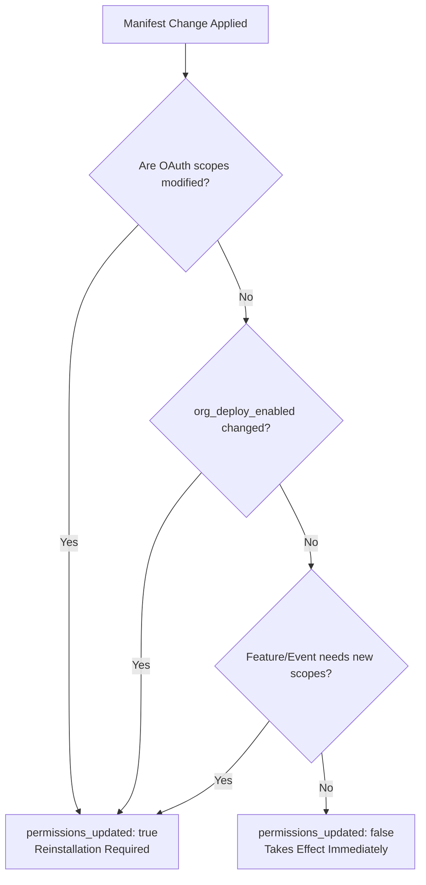

# 🚀 Slack App Lifecycle & Distribution

A comprehensive guide for architecting, distributing, and maintaining Slack applications across single-workspace, unlisted multi-workspace, and public Slack Marketplace environments.

---

## 🎯 Scope & Triggers

Activate this skill when:
- Designing or implementing multi-workspace installation flows (OAuth 2.0).
- Choosing between **Undistributed**, **Unlisted Public Distribution**, or **Slack Marketplace listing**.
- Updating app manifests (`manifest.json`) or invoking `apps.manifest.update`.
- Assessing whether a configuration change requires workspace re-authorization (`permissions_updated: true`).
- Debugging unexpected app uninstalls or designing offboarding cleanup handlers (`app_uninstalled`).
- Setting up automated deployment pipelines with the Slack CLI (`slack deploy`) and CI/CD hooks.
- Configuring Enterprise Grid support (`org_deploy_enabled`, `is_enterprise_install`).

---

## 1. Distribution Models: Decision Matrix

Slack provides three distribution tiers. Choosing the correct tier determines authentication architecture, token storage requirements, and review processes:

| Feature / Requirement | Undistributed (Single Workspace) | Unlisted Public Distribution | Listed (Slack Marketplace) |
|---|---|---|---|
| **Primary Use Case** | Internal tools, workspace pilots, dev environments | Customer pilots, private betas, multi-tenant B2B SaaS before directory submission | Public commercial SaaS, self-serve discoverability |
| **Discoverability** | None (private to associated workspace) | Direct shareable URL, "Add to Slack" button, HTML meta tag suggestions | Searchable in Slack Marketplace & in-client app directory |
| **Review Process** | None required | None required (instant activation) | Formal review by Slack App Review team (security, UX, guidelines) |
| **Authentication Flow** | One-click install from App Dashboard; static bot token | OAuth 2.0 authorization code grant (`oauth.v2.access`) | OAuth 2.0 authorization code grant + optional Direct Install |
| **Token Storage** | Single static token (env var or secret store) | Relational database (per-workspace `team_id`, `enterprise_id`, `bot_user_id`, `access_token`) | Relational database with multi-tenant encryption & token management |
| **SSL Requirements** | Optional for dev (Socket Mode / ngrok) | Mandatory HTTPS on all public endpoints | Mandatory HTTPS on all public endpoints |
| **Deactivation Impact** | Reinstall to home workspace | Revokes tokens and uninstalls from all external workspaces immediately | Requires formal unlisting / discontinuing review flow |

---

## 2. Technical Prerequisites for Distribution

Before activating public distribution (unlisted or marketplace), the app backend must meet strict production requirements:

### A. SSL & Endpoint Security (Mandatory HTTPS)
Slack requires valid TLS/SSL certificates (no self-signed certificates) for all exposed endpoints:
- **OAuth Redirect URLs**: `oauth_config.redirect_urls`
- **Interactivity & Shortcuts**: `settings.interactivity.request_url`
- **External Options Load URLs**: Dynamic Block Kit select menus (`external_select`)
- **Events API Request URLs**: `settings.event_subscriptions.request_url`
- **Slash Commands**: URL endpoints for every registered slash command

### B. Multi-Tenant Token Storage
When an app is distributed, tokens must be stored per installation:
```typescript
interface SlackInstallation {
  teamId?: string;           // Workspace ID
  enterpriseId?: string;     // Enterprise Grid Org ID (if installed org-wide)
  isEnterpriseInstall: boolean;
  botToken: string;          // xoxb-...
  botUserId: string;         // Bot user ID
  installedByUserId: string; // User who authorized the install
  installedAt: Date;
  scopes: string[];          // Authorized scopes snapshot
}
```

### C. Enterprise Grid Compatibility
Distributed apps will inevitably be installed by enterprise organizations:
- Handle `is_enterprise_install: true`.
- When `is_enterprise_install` is true, the installation token can cover all workspaces in the Grid or be scoped to individual workspaces depending on whether `org_deploy_enabled` is active in the manifest.
- Store `enterprise_id` and query by `enterprise_id` when `team_id` is null or shared.

### D. Scalable Onboarding
Direct hands-on onboarding fails as workspace counts scale:
- Implement the `app_home_opened` event listener.
- Deliver an initial onboarding guide in the App Home tab (`home` view) or via a single non-intrusive direct message from the bot upon install.
- Keep welcome copy concise and actionable (direct commands, no fluff).

---

## 3. Activation & Deactivation Mechanics

### Enabling Unlisted Distribution
1. Navigate to the **App Dashboard** (`api.slack.com/apps`).
2. Open **Manage Distribution** > **Share Your App with Other Workspaces**.
3. Complete all checklist items:
   - Scopes declared with least privilege.
   - Redirect URLs configured with HTTPS.
   - Privacy Policy and Support URLs provided.
4. Click **Activate Public Distribution**.
5. Retrieve:
   - **Sharable URL**: Direct link starting the OAuth flow.
   - **Embeddable "Add to Slack" Button**: Pre-built HTML snippet.
   - **App Suggestions Meta Tag**: `<meta name="slack-app-id" content="A...">` for websites.

### Deactivating Distribution
- Clicking **Deactivate Public Distribution** in the App Dashboard:
  - Immediately revokes access tokens for all external workspaces.
  - Automatically uninstalls the app from every external workspace.
  - **Retains the app only in the original associated home workspace.**
- *Note:* Apps listed in the Slack Marketplace cannot be deactivated via this toggle; they must follow the Marketplace unlisting procedure.

---

## 4. Uninstallation Mechanics & Scope-Linked Risk

### A. The `app_uninstalled` Event
Always subscribe to `app_uninstalled` in `settings.event_subscriptions.bot_events`.
When received:
1. Revoke local token records or mark the workspace installation as `INACTIVE`/`CHURNED`.
2. Cancel all pending cron jobs, queued notifications, or active tracking intervals for that `team_id`.
3. Clear cached team metadata.

### B. Critical Rule: Automatic Uninstallation by Scope
Slack enforces distinct uninstallation rules based on the scopes granted to the app:

| Scope Profile | Auto-Uninstall Trigger |
|---|---|
| **Basic Bot Scopes Only** (`bot`, `incoming-webhook`, `commands`, `identify`) | **Will NOT be automatically uninstalled** when the installing user leaves the workspace or becomes a guest. Exception: In the *associated home workspace*, the app is uninstalled if the last creator or collaborator leaves or becomes a guest. |
| **Extended Scopes** (Any scope beyond the 4 above, e.g. `channels:read`, `chat:write`, `users:read`, `canvas:write`) | **AUTOMATICALLY UNINSTALLED** from the workspace if the user who authorized the installation leaves the workspace or is converted into a guest account! |

#### Operational Guidance:
- Favor granular bot tokens (`xoxb-`) over user tokens (`xoxp-`) whenever possible.
- If extended scopes are required, advise customer admins to install via a dedicated service account / bot administrator user, or implement re-authorization flows before offboarding key personnel.

---

## 5. Manifest Updates & The Reinstallation Matrix

When modifying `manifest.json` (or calling `apps.manifest.update`), Slack categorizes changes into those that apply immediately and those that require workspace reinstallation.

The response from `apps.manifest.update` contains a programmatic boolean flag:
```json
{
  "ok": true,
  "app_id": "A0123456789",
  "permissions_updated": true
}
```
If `permissions_updated: true`, existing installations will not receive new permissions until re-authorized by a workspace administrator.

### The Impact Matrix



### Detailed Breakdown

#### 1. Changes Requiring Reinstallation (`permissions_updated: true`)
- **Adding scopes**: Any addition to `oauth_config.scopes.bot` or `oauth_config.scopes.user`. Existing tokens do not acquire new privileges until re-authorized.
- **Removing scopes**: Configuration updates immediately for *new* installs, but **existing tokens retain removed scopes** until reinstalled or explicitly revoked. Scope removal may trigger breaking change warnings to workspaces.
- **Enabling Org-Wide Deployment**: Setting `settings.org_deploy_enabled: true`.
- **Features requiring new scopes**: Adding AI Assistant features (`assistant_view`), Canvas operations, or events requiring additional permission sets.

#### 2. Changes Taking Effect Immediately (`permissions_updated: false`)
- **Display & Branding**: App name (`display_information.name`), short/long description, background color, app icon.
- **Bot Identity**: `features.bot_user.display_name`, `features.bot_user.always_online`.
- **App Surfaces & Features (no scope delta)**:
  - App Home configuration (`home`, `messages_tab`, `messages_tab_read_only_enabled`).
  - Slash commands (`features.slash_commands`).
  - Shortcuts & modal actions (`features.shortcuts`).
  - Link unfurls (`features.unfurl_domains`).
  - Workflow steps (`features.workflow_steps`).
- **Settings & URLs**:
  - Request URLs (`event_subscriptions.request_url`, `interactivity.request_url`).
  - IP whitelisting (`settings.allowed_ip_address_ranges`).
  - Socket Mode toggle (`settings.socket_mode_enabled`).

#### 3. Edge Cases & Security Properties
- **Redirect URLs (`oauth_config.redirect_urls`)**: Modifying redirect URLs does not invalidate active tokens, but new OAuth handshakes fail immediately if the redirect URI does not match the updated list.
- **Token Management & PKCE (`pkce_enabled`, `token_management_enabled`, `token_rotation_enabled`)**: Enabling token rotation requires the app to consume and store `refresh_token` payloads on every token expiration cycle.

---

## 6. Automated CI/CD Lifecycle via Slack CLI

Avoid manual UI modifications in production. Use configuration as code via `manifest.json` and the Slack CLI.

### A. Deploy Hooks (`.slack/hooks.json`)
Declare deployment automation in `.slack/hooks.json`:
```json
{
  "hooks": {
    "get-hooks": "npx -q --no-install -p @slack/cli-hooks slack-cli-get-hooks",
    "deploy": "git push heroku main"
  }
}
```

When executing `slack deploy`:
1. Validates and applies updates in `manifest.json`.
2. Inspects `permissions_updated` to notify of required reinstalls.
3. Executes the custom `deploy` hook command (e.g. cloud deployment or build script).

### B. Production GitHub Actions Workflow
Automate manifest synchronization and deployment on merges to `main`:

```yaml
name: Deploy Slack App
on:
  push:
    branches:
      - main

jobs:
  deploy:
    runs-on: ubuntu-latest
    timeout-minutes: 5
    steps:
      - name: Checkout Code
        uses: actions/checkout@v4

      - name: Install Slack CLI
        run: |
          curl -fsSL https://downloads.slack-edge.com/slack-cli/install.sh | bash

      - name: Sync Manifest and Deploy
        env:
          SLACK_SERVICE_TOKEN: ${{ secrets.SLACK_SERVICE_TOKEN }}
        run: |
          slack deploy -s --token "$SLACK_SERVICE_TOKEN"
```

---

## 7. Pre-Flight Distribution Checklist

Run this verification checklist before toggling public distribution or releasing manifest updates:

- [ ] **HTTPS Verification**: All URLs (OAuth redirect, Events, Interactivity) resolve to valid TLS endpoints.
- [ ] **Least Privilege Scopes**: No extraneous bot or user scopes declared.
- [ ] **Multi-Tenant Token Vault**: Tokens stored indexed by `team_id` (and `enterprise_id`), never hardcoded.
- [ ] **`app_uninstalled` Handler**: Endpoint registered, tested, and actively purging/deactivating tenant state upon call.
- [ ] **Reinstallation Audit**: If `permissions_updated: true` will be triggered, notification plan prepared for existing workspace admins.
- [ ] **Onboarding & Home Surface**: `app_home_opened` configured with immediate, intuitive telemetry and clear command instructions.
