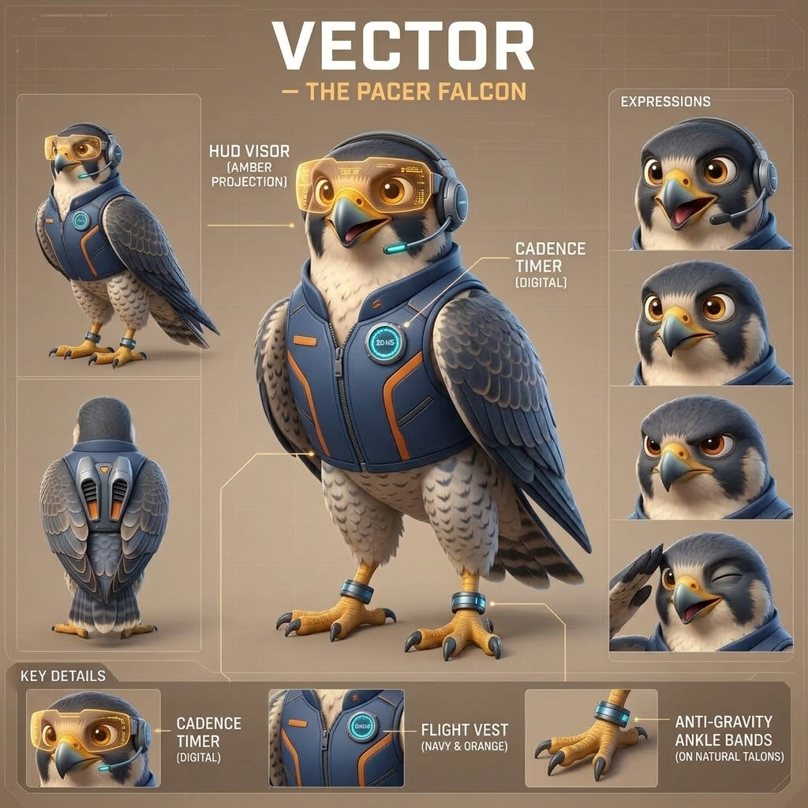
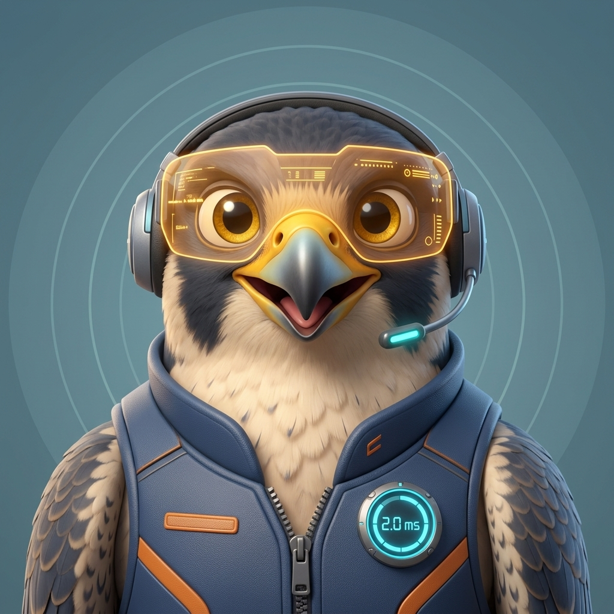

# HuddlePace ⏱️🦅
### *Keep your team in sync, on pace, and out of endless meetings.*

> **Mascota Oficial**: **Vector — The Pacer Falcon**  
> **Ecosistema**: *Vibecoder Universe*  
> **Instalación Oficial**: [https://huddlepace.com/slack/install](https://huddlepace.com/slack/install)  
> **API & Health**: `https://huddlepace.com/healthz`

---

## 1. ¿Qué es HuddlePace?

**HuddlePace** es un bot de cadencia y productividad para Slack diseñado para equipos ágiles, desarrolladores e ingenieros que valoran su foco. 

Las reuniones no estructuradas suelen extenderse el doble de lo planeado debido a la falta de visibilidad del tiempo. HuddlePace actúa como el copiloto de tus huddles y canales de Slack, estableciendo límites claros, recordatorios oportunos de cadencia y alertas de aterrizaje antes de que la reunión consuma el tiempo productivo del equipo.

---

## 2. Hoja de Personaje: Vector (The Pacer Falcon)

En el universo de *Vibecoder*, mientras **Cluck-O** programa a toda velocidad en su trinchera con su arnés de código, **Vector** es el navegante de vuelo que mantiene la cadencia y el rumbo del equipo.



### Elementos Distintivos y Ficha Técnica

| Elemento | Especificación |
| :--- | :--- |
| **Especie** | Halcón Peregrino (*Falco peregrinus*), el ave más veloz del planeta. |
| **HUD Visor Ámbar** | Visor holográfico flotante que proyecta la telemetría del tiempo sin tapar su mirada cálida y atenta. |
| **Headset de Aviación** | Auricular ergonómico con micrófono estilizado y LED cian para comunicación nítida. |
| **Flight Vest** | Chaleco técnico de vuelo azul marino con acentos naranja y reloj de cadencia digital integrado en la solapa. |
| **Garras con Anillos Antigravedad** | Patas naturales y ágiles equipadas con sensores de telemetría y balance gravitacional. |
| **Microtoberas Posteriores** | Propulsores vectorizados discretamente integrados en el chaleco para maniobras y cambios rápidos de rumbo. |

### Assets Visuales Disponibles

| Asset | Archivo | Uso Principal |
| :--- | :--- | :--- |
| **Avatar Slack** | [`assets/avatar.png`](../assets/avatar.png) | Icono de perfil en Slack App Directory (512x512). |
| **Vista de Perfil** | [`assets/profile_view.jpg`](../assets/profile_view.jpg) | Retrato cinematográfico para banners, web y prensa. |
| **Hoja de Personaje** | [`assets/character_sheet.jpg`](../assets/character_sheet.jpg) | Guía de modelo con vistas 3/4, perfil, espalda y expresiones. |




---

## 3. Características Principales (Features)

### 🚀 1. Temporizador de Huddles en Tiempo Real (`/pace`)
Inicia una sesión de ritmo en cualquier canal o hilo de Slack con un simple comando:
```text
/pace 15m "Daily Sync & Blockers"
```
- Opciones de tiempo preconfiguradas (5m, 10m, 15m, 25m) o duración personalizada.
- Notificaciones automáticas en momentos clave:
  - **Mitad del recorrido**: Recordatorio para revisar bloqueos pendientes.
  - **Últimos 2 minutos**: Alerta de aterrizaje para resumir acuerdos y próximos pasos.
  - **Tiempo cumplido**: Cierre formal de la sesión para liberar el canal.

### 🌐 2. Distribución Multi-Tenant con OAuth v2 ("Add to Slack")
- Cualquier equipo o workspace externo puede instalar HuddlePace en 1 clic desde `https://huddlepace.com/slack/install`.
- Almacenamiento seguro y aislado de tokens por workspace mediante `SlackInstallationStore` y base de datos relacional.
- Cero configuración técnica por parte del usuario final (no requiere ngrok ni configuración de App ID).

### 🏠 3. Slack App Home Interactivo
- Panel de control personal en la pestaña de inicio de la app en Slack.
- Visualización de métricas de equipo: duración promedio de reuniones, porcentaje de huddles finalizados a tiempo.
- Acceso directo a configuración de canal y preferencias de alerta.

### 🔒 4. Privacidad y Seguridad por Diseño
- **Cero grabación invasiva**: HuddlePace no graba audio ni almacena conversaciones privadas; solo gestiona tiempos, estados de sesión y participantes.
- **Validación Criptográfica HMAC-SHA256**: Cada petición entrante desde Slack es validada criptográficamente con `Signing Secret`.
- **Cifrado en Tránsito**: Conexiones forzadas por HTTPS con certificados SSL emitidos por Let's Encrypt y proxy seguro a través de Cloudflare.

---

## 4. Tono de Marca y Personalidad (Brand Voice)

- **Ágil y Positivo**: Celebra cuando las reuniones terminan a tiempo y el equipo gana tiempo productivo.
- **Sin Burocracia**: Mensajes directos, limpios y visualmente claros, sin textos redundantes ni jerga corporativa pesada.
- **Orientado al Equipo**: Un copiloto amigable que cuida la energía del grupo para que todos vuelvan a construir.

---

## 5. Copy & Material Promocional

### Pitch Corto (One-Liner)
> *"Reuniones que vuelan, no que se arrastran. Mantén tus huddles de Slack a tiempo y enfocados con Vector."*

### Elevator Pitch (30 segundos)
> *"Los equipos ágiles pierden decenas de horas al mes en llamadas que debían durar 10 minutos pero se alargan indefinidamente. HuddlePace introduce una cadencia visual en tus huddles de Slack: cronometra, avisa a la mitad de tiempo y asegura que el equipo aterrice con accionables claros antes de que suene la alarma. Instálalo en un clic y dale a tu equipo la velocidad de un halcón."*
